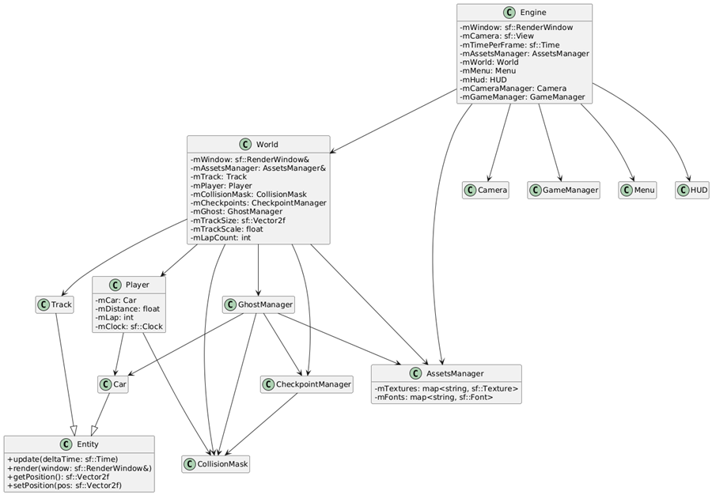

# RetroRush 🏁

RetroRush est un jeu de course en 2D développé en C++ avec la bibliothèque **SFML 3.0**. Il propose une expérience arcade de contre-la-montre avec fantôme, système de checkpoints et interface utilisateur dynamique.

## 👨‍💻 Auteurs

Ce projet a été conçu et développé dans le cadre d’un projet de fin de module en C++ par :

- **Thomas Geffroy**
- **Gustave Alnot**
- **Tom Cabanau**

## 🧩 Fonctionnalités

- Détection de **checkpoints** et validation de tour.
- Système de **contre-la-montre** avec enregistrement et affichage du **fantôme** de la meilleure run.
- **HUD dynamique** avec vitesse, chronomètre, meilleurs temps et compte à rebours.
- **Caméra intelligente** centrée sur le joueur, restreinte aux bords du circuit.
- Menu d’accueil avec **lancement/rejouer**.
- Gestion complète de la physique de la voiture : **drift, herbe, friction, accélération**.

## 🕹️ Contrôles

| Touche | Action              |
|--------|---------------------|
| Z      | Accélération        |
| S      | Frein / marche arrière |
| Q      | Tourner à gauche    |
| D      | Tourner à droite    |

## 🗂️ Organisation du projet

- `Engine.*` : boucle principale du jeu, gestion des états.
- `World.*` : interface entre entités (car, ghost, checkpoints).
- `Car.*` : entité voiture avec physique et contrôle.
- `GhostManager.*` : enregistre et rejoue les déplacements du fantôme.
- `CheckpointManager.*` : gère la validation de passage aux points de contrôle.
- `HUD.*` : affichage des informations de jeu.
- `Menu.*` : affichage du menu principal.
- `Camera.*` : gestion du centrage de la vue.
- `AssetsManager.*` : chargement des polices et textures.
- `Config.h` : paramètres globaux du jeu.

## 📊 Diagramme UML

